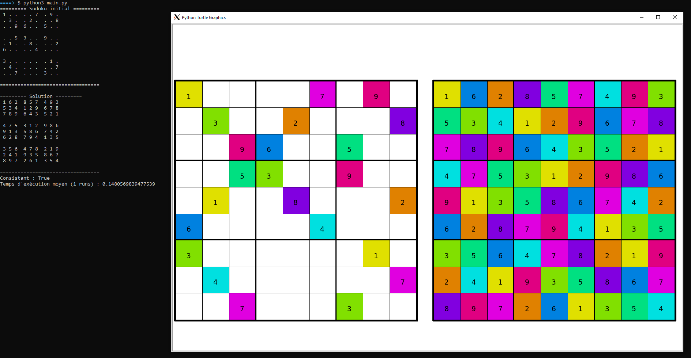

# AI projects as part of a UQAC course

## MansionCleaner

Goal is to implement a cleaning robot for a mansion.
The agent will evolve in a matrix in which dirt and jewels are generated randomly.
The robot has to clean dirt, pickup jewels and be the most efficient as possible.
Every action cost him energy and reduces his performance, he also gets a penalty if he sucks a jewel with dirt instead of picking it up first.
Viewing the mansion in order to re generate his list of actions to perform also costs him energy.
Depending on his performance, the robot is able to adapt the maximum number of actions he will do before looking at the entire mansion again. This allows him to detect more frequently newly added dirt and jewels if he needs it.
Four search algorithms were implemented and can be passed to the robot for him to choose his actions.
- non informed search :
  - Bread-First Search
  - Depth-First Search
- informed search :
  - Greedy search
  - A*
  
  

### Getting Started

To run MansionCleaner, working directory must be ```src/```, then simply run ```python3 main.py```.

## SudokuSolver

Goal is to implement a sudoku solver using CSP method. (Constraint Satisfaction Problems)
Algorithms implemented in this CSP project :
- Backtracking algorithm
- MRV Minimum Remaining Values
- Degree Heuristic
- Least Constraining Value
- Forward Checking
- AC-3 algorithm

  

### Getting Started

To run SudokuSolver, working directory must be ```src/```, then simply run ```python3 main.py```.
If you want to try and solve a different sudoku, simply edit `ressources/sudoku.txt` which is the file used by the program.
The first line has to be the size of the sudoku (can be any as long it is a regular squared sudoku)
Fill it with numbers, empty boxes must be represented with a dot `.` and there must be a space in between every box.
